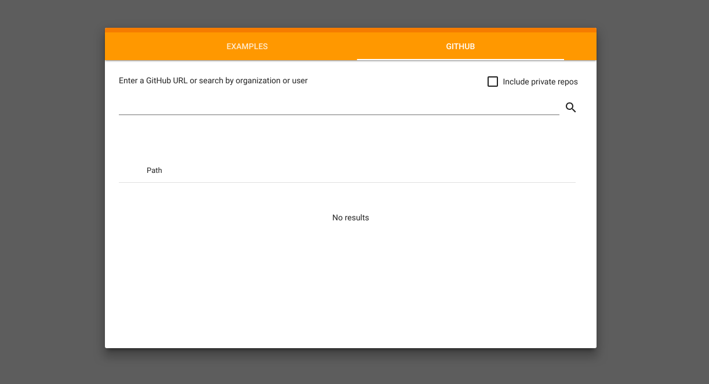
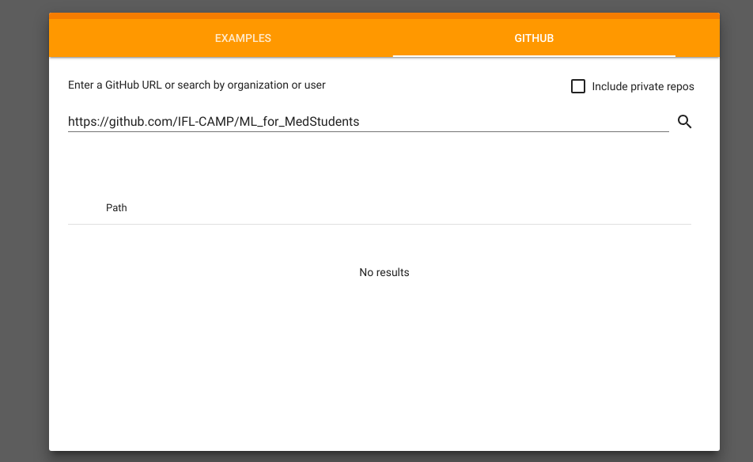
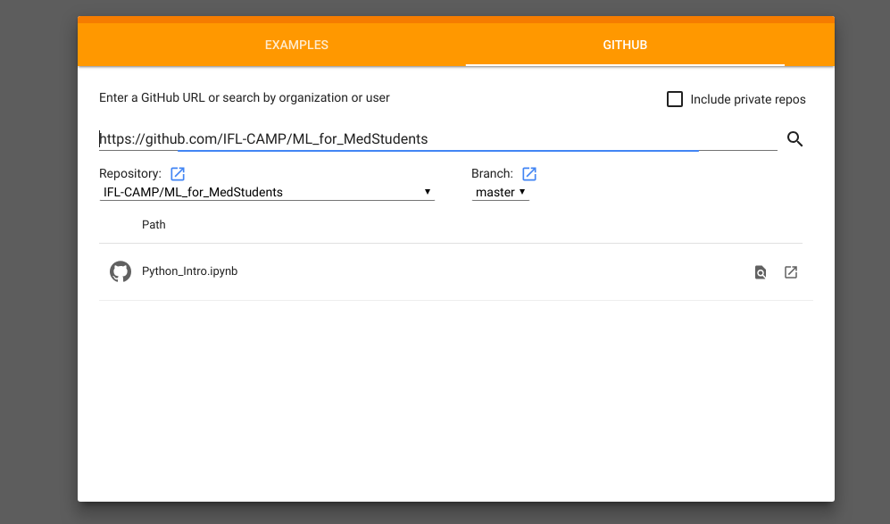

# How to run the notebooks in Google Colab

First of all you need to login to your Google account.

Go to the URL: **https://colab.research.google.com/github/**

A webpage will open like this:

Enter the URL of the Github repository: *https://github.com/IFL-CAMP/ML_for_MedStudents* 

Then click search or press Enter. The widget will display the notebooks in the repository.

Click on the Jupyter Notebook you want to work on. And Colab will launch the notebook.

Once the notebook is launched, click on connect button at the top right corner.

You are now set to run the notebook:
- You can run each cell by pressing **Shift+Enter**

or

- Go to **Runtime** menu at the top and click on **Run all** to run all cells.
